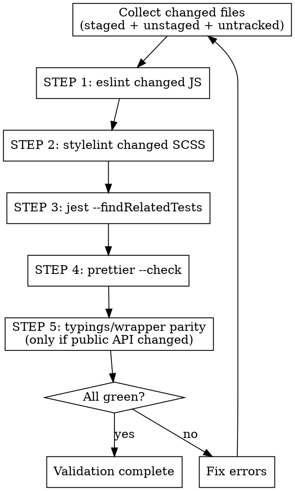

# Audit Changes

## Overview

Validation pipeline for Britecharts code changes: lint the changed JS, lint the changed SCSS, run the Jest suites related to the changed files, check formatting, and fix any failure until everything is green. This is the routine check to run *during* development.

Britecharts has **no type-check step** — there is no `tsconfig.json` and nothing compiles the hand-written `.d.ts` typings in `packages/*/src/typings/`. Do not look for one, and see Step 5 for the manual typings check that replaces it.

The root `yarn check` script (`lint:styles && lint:js && test:ci`) is the full, unscoped gate. Prefer the scoped steps below while iterating — they are far faster — and save `yarn check` for a final pass on a broad change.

## Workflow



### Step 0: Collect the Changed Files

Run everything from the repo root. Local mode covers staged, unstaged **and** untracked files:

```bash
{ git diff --name-only --diff-filter=ACMR
  git diff --cached --name-only --diff-filter=ACMR
  git ls-files --others --exclude-standard
} | sort -u | while read -r f; do [ -f "$f" ] && echo "$f"; done
```

For full branch mode, replace the first two commands with:

```bash
git diff --name-only --diff-filter=ACMR "$(git merge-base HEAD main)"...HEAD
```

`main` is the integration branch for v3 (it is also the changesets `baseBranch`). `master` is the v2 maintenance line and `origin/HEAD` still points at it — do **not** diff against `master` unless the user is explicitly working on a v2 backport.

Split the list into JS/JSX (`.js`, `.jsx`, `.mjs`, `.cjs`) and SCSS (`.scss`). Skip `.json` fixtures, `yarn.lock`, `dist/`, `lib/` and anything under `node_modules/`.

### Step 1: Lint the Changed JS

```bash
yarn eslint <changed js files>
```

Matches CI (`.github/workflows/lint.yml` runs `yarn lint:js`), but scoped to what you touched. Run eslint directly rather than through the workspace `lint:js` scripts — those are globbed to `src/charts/` plus the webpack configs, and `@britecharts/react` has no `lint:js` script at all, so workspace scripts silently skip most of what you are likely editing.

Errors must be fixed. The repo is essentially warning-free, so **treat any warning on a line you touched as an error too** — the one known pre-existing warning is an unused `event` binding in `packages/core/src/charts/line/line.js`. `no-console` and `no-debugger` are errors here: strip debug output before finishing.

Auto-fixable violations: `yarn eslint --fix <files>`.

### Step 2: Lint the Changed SCSS

Only if `.scss` files changed:

```bash
yarn exec stylelint <changed scss files>
```

Use `yarn exec stylelint`, not `yarn stylelint` — the latter runs the root *script*, which has its own hard-coded glob and would append your paths to it. Auto-fix with `yarn exec stylelint --fix <files>`.

Note that Prettier deliberately ignores `.scss` (see `.prettierignore`): stylelint owns SCSS formatting, and running Prettier over it produces quoting that stylelint then rejects.

### Step 3: Run the Related Tests

```bash
yarn jest --findRelatedTests <changed js files> --coverage=false
```

Run this from the repo root. The root `jest.config.js` registers every package as a Jest project, so one invocation covers `core`, `wrappers` and `react` and picks up the sibling suites that a change ripples into. `--coverage=false` overrides the root config's `collectCoverage` and keeps the run fast.

If a change has no related test at all (a new helper, a new chart accessor), that is itself a finding — say so, and add the spec next to the source (`foo.js` → `foo.spec.js`).

Full suite, when the change is broad: `yarn test:ci`.

Use `test:ci`, **not** the root `yarn test`. The root has a `posttest` hook that runs `yarn format`, so `yarn test` rewrites every `.js` file in the repo on the way out and buries your diff. `test:ci` runs the same suites without the hook.

### Step 4: Check Formatting

```bash
yarn exec prettier --check <changed js files>
```

Write the fixes with `yarn exec prettier --write <changed js files>`. Keep it scoped — the root `yarn format` rewrites every `.js` in the repo and will bury your diff. Prettier here is 4-space, single-quote, semicolons.

### Step 5: Typings and Wrapper Parity (public API changes only)

Nothing type-checks this repo, so drift in the hand-written typings is invisible until it ships. If the change added, removed or renamed a **public chart accessor** in `packages/core/src/charts/`, verify by hand:

1. `packages/core/src/typings/charts/<chart>.d.ts` declares the accessor.
2. `packages/wrappers/src/charts/` passes it through, if that chart has a wrapper.
3. `packages/react/src/charts/` exposes it, if that chart has a React component.
4. A changeset exists in `.changeset/` describing the user-facing change (`yarn changeset`). The `core`/`wrappers`/`react` packages are version-`fixed` together; `docs` and `demos` are ignored.

### Step 6: Fix and Repeat

If any step fails:

1. Read the error output carefully.
2. Fix the **root cause** — not the assertion, not the lint rule.
3. Re-run the failing step, then re-run the whole pipeline once it passes.
4. Repeat until every step is green.

**Do NOT skip steps unless the user explicitly requests it.**

## Command Reference

| Purpose | Scoped (use this) | Full |
|---|---|---|
| Lint JS | `yarn eslint <files>` | `yarn lint:js` |
| Lint SCSS | `yarn exec stylelint <files>` | `yarn lint:styles` |
| Test | `yarn jest --findRelatedTests <files> --coverage=false` | `yarn test:ci` |
| Format | `yarn exec prettier --check <files>` | `yarn format` |
| Build | — | `yarn build:packages` |
| Everything | — | `yarn check` |

Node comes from `.nvmrc` (24). Yarn 3 via Corepack — never `npm` or `pnpm` in this repo.

## Common Mistakes

- Reaching for the unscoped `yarn check` on every iteration; it lints and tests the whole repo, so use the scoped steps while working.
- Diffing against `master` or `origin/HEAD`; the v3 integration branch is `main`.
- Relying on the workspace `lint:js` scripts for a targeted audit — they miss `packages/react` entirely and anything outside `src/charts/`.
- `yarn stylelint <file>` instead of `yarn exec stylelint <file>`, which appends the file to the script's own glob.
- Running the root `yarn format` mid-change, which reformats the whole repo into your diff.
- Running Prettier over `.scss`; it is ignored on purpose and fighting stylelint over quotes.
- Looking for a type-check step. There isn't one — do Step 5 manually instead.
- Forgetting the changeset for a user-facing change to `core`, `wrappers` or `react`.
