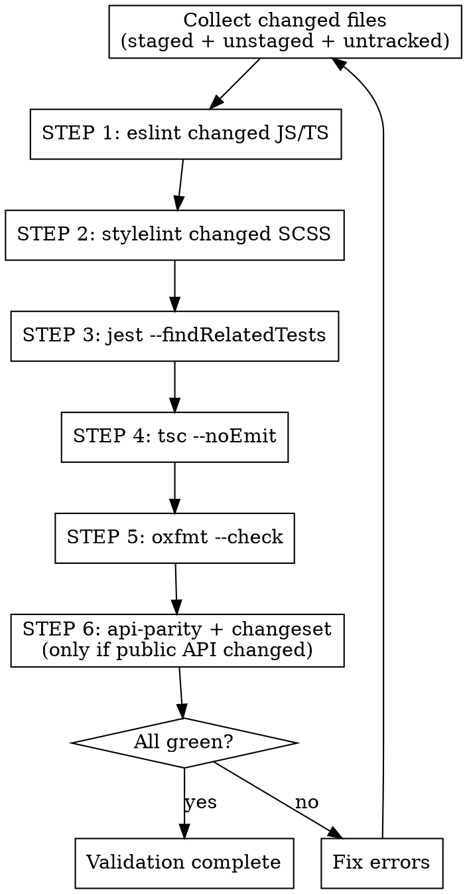

# Audit Changes

## Overview

Validation pipeline for Britecharts code changes: lint the changed JS/TS, lint the changed SCSS, run the Jest suites related to the changed files, type-check, check formatting, and fix any failure until everything is green. This is the routine check to run *during* development.

The root `pnpm check` script (`lint:styles && lint:js && type-check && test:ci`) is the full, unscoped gate. Prefer the scoped steps below while iterating — they are far faster — and save `pnpm check` for a final pass on a broad change. When the work is **done**, run `/quality` instead: it dispatches the three review agents rather than the toolchain.

## Workflow


```dot
digraph audit {
    rankdir=TB;
    node [shape=box];

    collect [label="Collect changed files\n(staged + unstaged + untracked)"];
    lint    [label="STEP 1: eslint changed JS/TS"];
    styles  [label="STEP 2: stylelint changed SCSS"];
    test    [label="STEP 3: jest --findRelatedTests"];
    types   [label="STEP 4: tsc --noEmit"];
    format  [label="STEP 5: oxfmt --check"];
    api     [label="STEP 6: api-parity + changeset\n(only if public API changed)"];
    pass    [label="All green?" shape=diamond];
    fix     [label="Fix errors"];
    done    [label="Validation complete"];

    collect -> lint -> styles -> test -> types -> format -> api -> pass;
    pass -> done [label="yes"];
    pass -> fix  [label="no"];
    fix -> collect;
}
```

### Step 0: Collect the Changed Files

Run everything from the repo root. Local mode covers staged, unstaged **and** untracked files:

```bash
{ git diff --name-only --diff-filter=ACMR
  git diff --cached --name-only --diff-filter=ACMR
  git ls-files --others --exclude-standard
} | sort -u | while read -r f; do [ -f "$f" ] && echo "$f"; done
```

For full branch mode, replace the first two commands with:

```bash
git diff --name-only --diff-filter=ACMR "$(git merge-base HEAD main)"...HEAD
```

`main` is the integration branch for v3 (it is also the changesets `baseBranch`). `master` is the v2 maintenance line and `origin/HEAD` still points at it — do **not** diff against `master` unless the user is explicitly working on a v2 backport.

Split the list into script files (`.js`, `.jsx`, `.mjs`, `.cjs`, `.ts`, `.tsx`) and SCSS (`.scss`). Skip `.json` fixtures, `pnpm-lock.yaml`, `dist/`, `lib/` and anything under `node_modules/`.

The `.ts`/`.tsx` extensions matter: a TypeScript migration is converting `packages/core` and has already converted `packages/wrappers`, so a changed file is as likely to be `.ts` as `.js`. A glob that says only `.js` silently skips it — that exact assumption has shipped bugs here more than once.

### Step 1: Lint the Changed JS/TS

```bash
pnpm exec eslint <changed script files>
```

Matches CI (`.github/workflows/lint.yml` runs `pnpm run lint:js`), but scoped to what you touched. Run eslint directly rather than through the workspace `lint:js` scripts: those are globbed to `src/charts/` plus the webpack configs, and `@britecharts/react` additionally passes `--ignore-pattern "*.spec.js"`, so the workspace scripts skip specs and anything outside those paths.

Errors must be fixed. **Treat any warning on a line you touched as an error too.** The repo's baseline is 10 warnings, 0 errors — six in `packages/core/src/charts/helpers/grid.ts` (`one-var`, `no-explicit-any`) and four unused `event` bindings in `grouped-bar.js`, `line.js` and `stacked-area.js`. Anything beyond those is yours. `no-console` and `no-debugger` are errors here: strip debug output before finishing.

The TypeScript override runs a stricter rule set than the JavaScript one — `prefer-const` is an error on `.ts` where it sat unflagged on `.js`. Those are real; take them rather than widening the override.

Auto-fixable violations: `pnpm exec eslint --fix <files>`.

### Step 2: Lint the Changed SCSS

Only if `.scss` files changed:

```bash
pnpm exec stylelint <changed scss files>
```

Use `pnpm exec stylelint`, not `pnpm stylelint` — the latter runs the root *script*, which has its own hard-coded glob (`./packages/core/src/styles/**/*.scss`) and would append your paths to it. Auto-fix with `pnpm exec stylelint --fix <files>`.

`oxfmt` deliberately ignores `.scss` (`"*.scss"` is in `.oxfmtrc.json`'s `ignorePatterns`): stylelint owns SCSS formatting.

### Step 3: Run the Related Tests

```bash
pnpm exec jest --findRelatedTests <changed script files> --coverage=false
```

Run this from the repo root. The root `jest.config.js` registers every package as a Jest project (`packages/*/jest.config.js`), so one invocation covers `core`, `wrappers` and `react` and picks up the sibling suites that a change ripples into. `--coverage=false` overrides the root config's `collectCoverage` and keeps the run fast.

**Run the whole workspace's tests, not just the converted package's,** whenever you change a file another package imports. This has bitten: converting one wrappers file broke all 16 react suites while wrappers' own suite stayed green, because every react spec reaches wrappers through its source barrel.

If a change has no related test at all (a new helper, a new chart accessor), that is itself a finding — say so, and add the spec next to the source (`foo.ts` → `foo.spec.ts`).

Full suite, when the change is broad: `pnpm run test:ci`.

Use `test:ci`, **not** the root `pnpm test`. The root has a `posttest` hook that runs `pnpm run format`, and pnpm does execute post scripts, so `pnpm test` reformats the repo on the way out and buries your diff. `test:ci` runs the same suites without the hook.

### Step 4: Type-check

```bash
pnpm run type-check
```

This fans out to `tsc --noEmit` in `core`, `wrappers` and `react` via `pnpm -r`, and it is a CI gate (`lint.yml`, "Type-checking"). For one package while iterating:

```bash
pnpm --filter @britecharts/core run type-check
```

Type-check even when you only touched `.js`. `allowJs` is on, the packages share a root `tsconfig.base.json` with `strict: true`, and a `.js` change can break a `.ts` consumer of it.

Never run a bare `tsc` in a package directory. Without `--noEmit` it writes `.js` beside every `.ts` source, which inflates the test count and breaks the docs build until cleaned up. TS5055 ("would overwrite input file") is the signal.

### Step 5: Check Formatting

```bash
pnpm exec oxfmt --check <changed script files>
```

**`--check` is not optional.** `oxfmt`'s default mode is `--write`, so a bare `pnpm exec oxfmt <files>` rewrites them in place — the opposite of prettier's default, and the trap if you are working from muscle memory.

Write the fixes deliberately with `pnpm exec oxfmt <files>` (or `--write`). Keep it scoped: the root `pnpm run format` globs `**/*.{js,ts,tsx}` across the repo and will bury your diff.

The style comes from `.oxfmtrc.json`: 4-space, single-quote, semicolons, 80 columns, `es5` trailing commas. Its `ignorePatterns` deliberately exclude `packages/core/src/typings/`, `packages/react/src/typings/`, the TypeScript integration fixture and `TS-wip/`, so nothing slated for deletion gets churned.

### Step 6: API Parity and Changeset (public API changes only)

If the change added, removed or renamed a **public chart accessor**, run the parity check rather than eyeballing it:

```bash
pnpm run check:api-parity
```

It compares every chart's runtime surface against its declaration **in both directions**, through the TypeScript compiler, so it resolves `Omit`, inherited members and intersections properly. It catches both an accessor the typings never declared and one they promise that does not exist. It is a CI gate too.

Then check by hand what it cannot see:

1. `packages/wrappers/src/charts/` passes the accessor through, if that chart has a wrapper.
2. `packages/react/src/charts/` exposes it, if that chart has a React component.
3. A changeset exists in `.changeset/` describing the user-facing change (`pnpm run changeset`). The `core`/`wrappers`/`react` packages are version-`fixed` together; `docs` and `demos` are ignored.

A renamed accessor or a changed dispatched event name is a breaking change to published consumers even when nothing inside this repo notices — it needs a `major`.

If the change touched a chart's JSDoc, regenerate the API pages and **assert the success line**, because an empty diff proves nothing if the run failed:

```bash
pnpm --filter @britecharts/docs run docs:api
```

### Step 7: Fix and Repeat

If any step fails:

1. Read the error output carefully.
2. Fix the **root cause** — not the assertion, not the lint rule.
3. Re-run the failing step, then re-run the whole pipeline once it passes.
4. Repeat until every step is green.

**Do NOT skip steps unless the user explicitly requests it.**

## Command Reference

| Purpose | Scoped (use this) | Full |
|---|---|---|
| Lint JS/TS | `pnpm exec eslint <files>` | `pnpm run lint:js` |
| Lint SCSS | `pnpm exec stylelint <files>` | `pnpm run lint:styles` |
| Test | `pnpm exec jest --findRelatedTests <files> --coverage=false` | `pnpm run test:ci` |
| Type-check | `pnpm --filter @britecharts/<pkg> run type-check` | `pnpm run type-check` |
| Format | `pnpm exec oxfmt --check <files>` | `pnpm run format` |
| API parity | — | `pnpm run check:api-parity` |
| Build | — | `pnpm run build:packages` |
| Everything | — | `pnpm check` |

Node comes from `.nvmrc` (24). pnpm 12.6.0 via Corepack (`packageManager` in the root manifest) — never `npm` or `yarn` in this repo.

`pnpm pack` is npm's builtin and packs the wrong thing — it packs `packages/integration` itself and leaves `.tarballs/` stale. The real command is `pnpm --filter @britecharts/integration run pack`.

## Common Mistakes

- Reaching for the unscoped `pnpm check` on every iteration; it lints, type-checks and tests the whole repo, so use the scoped steps while working.
- Diffing against `master` or `origin/HEAD`; the v3 integration branch is `main`.
- Collecting only `.js` and missing the `.ts`/`.tsx` the migration has produced.
- Relying on the workspace `lint:js` scripts for a targeted audit — they are globbed to `src/charts/` and skip specs in `react`.
- `pnpm stylelint <file>` instead of `pnpm exec stylelint <file>`, which appends the file to the script's own glob.
- Running `pnpm exec oxfmt <files>` without `--check` and silently rewriting them; `--write` is its default.
- Running the root `pnpm run format` mid-change, which reformats the whole repo into your diff.
- Running the root `pnpm test` instead of `test:ci`, whose `posttest` hook reformats everything.
- Running a bare `tsc` in a package, which emits `.js` beside every `.ts` source.
- Testing only the package you changed when another package imports it.
- Reading an empty `git status` after a docs run as "byte-identical" when the run actually failed.
- Forgetting the changeset for a user-facing change to `core`, `wrappers` or `react`.
