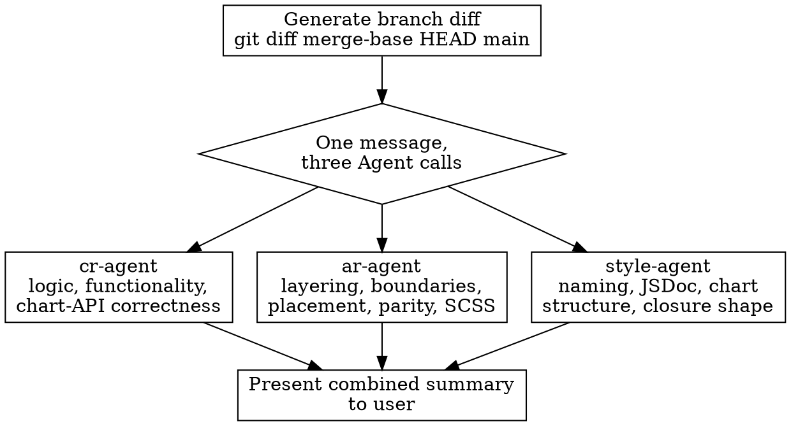

# Quality

## Overview

Post-completion quality gate that runs three reviews in parallel: code review (`cr-agent`), architecture review (`ar-agent`) and style review (`style-agent`). Use this after your implementation work is done and `/audit-changes` passes, but before merging or opening a PR.

There is no DRY leg, because this repo has no `dry-agent`. The nearest equivalent is the `/simplify` skill, which **applies** fixes rather than reporting them — so it cannot join a read-only parallel fan-out. Run it separately, after this gate, once you have decided what to act on.

## When to Use

- After finishing implementation and passing `/audit-changes`
- Before merging a feature branch or opening a PR
- When you want a final quality check on the full branch

**Do NOT use this during active development** — use `/audit-changes` for that. This skill is for when the work is done.

## Workflow



### Step 1: Generate Branch Diff

```bash
git diff --stat $(git merge-base HEAD main)...HEAD
git diff $(git merge-base HEAD main)...HEAD -- ':(exclude)*.json' ':(exclude)pnpm-lock.yaml'
```

`main` is the v3 integration branch; `origin/HEAD` still points at the v2 `master` line, so never let the gate default to `master`.

Excluding `pnpm-lock.yaml` matters: it is roughly a megabyte and would crowd out the real diff in all three reviews.

Each agent regenerates the diff itself as part of its own Step 1 — it is autonomous. Generating it here is for *your* summary and for spotting an empty or enormous diff before spending three agents on it.

### Step 2: Run Reviews in Parallel

Dispatch all three **in a single message, as three Agent tool calls**, so they run concurrently. Three sequential calls are the common mistake here and cost three times the wall clock.

**Code Review (`cr-agent`)**
- Reads the diff, the changesets in it, and `plan/1-high-level-plan.md` / `plan/2-implementation-plan.md` if they exist
- Writes prioritized findings (P0–P4), one file each, to `plan/cr-<batch>-<n>.md`
- Focus: logic, functionality, chart-API correctness, clarity of intent

**Architecture Review (`ar-agent`)**
- Reads the diff plus the package manifests, barrels and typings that express the architecture
- Writes findings, refactoring options and a recommendation to `plan/architecture-review.md`
- Focus: layering, boundaries, placement, three-tier API parity, declared dependencies, SCSS structure

**Style Review (`style-agent`)**
- Reads the diff plus the convention documents in `packages/docs/docs/topics/`
- Writes findings and naming proposals to `plan/style-review.md`
- Focus: accessor and variable naming, JSDoc completeness, chart file structure, the reusable-chart closure shape

The three overlap at two seams, and each agent knows which side it owns: `ar-agent` decides which layer a file belongs to while `style-agent` decides what the thing in it is called, and neither reports formatting, which `oxfmt` and ESLint own via `/audit-changes`.

### Step 3: Present Combined Summary

After all three return:

1. **Code review** — counts by priority, and every P0 and P1 with its title and location
2. **Architecture review** — the recommended option, and whether it is a breaking change needing a `major` changeset
3. **Style review** — new findings ordered by reach (a wrong accessor name or a missing JSDoc tag ships into the published API and the generated docs; an out-of-order accessor does not), plus any rename that is breaking
4. **The merge blockers** in one list: P0/P1 findings, a parity or dependency violation, and any published-API change without its changeset
5. Where the full reviews live (`plan/`, which is gitignored)

Report what the agents found, including "nothing" — three clean reviews is a one-line answer, not a reason to manufacture findings.

## Common Mistakes

- Running the gate during active development instead of after completion
- Dispatching the three agents sequentially instead of in one message
- Leaving `pnpm-lock.yaml` in the diff
- Addressing P3/P4 findings before P0/P1
- Treating a stale convention document as a code finding — `style-agent` separates those, and the document is usually the cheaper fix
